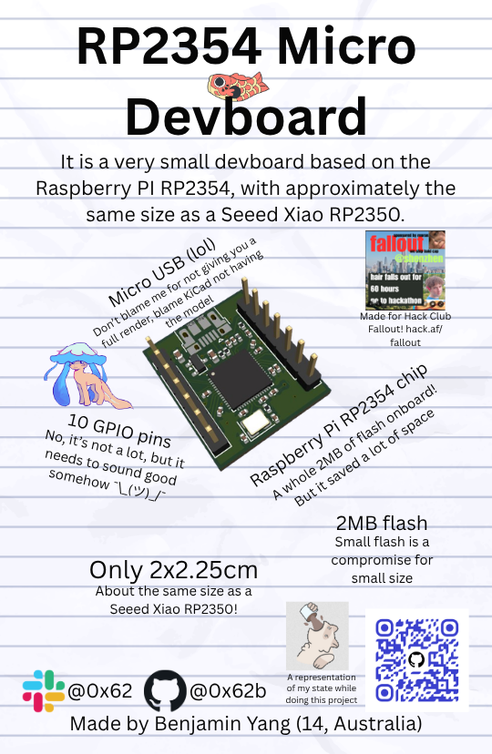
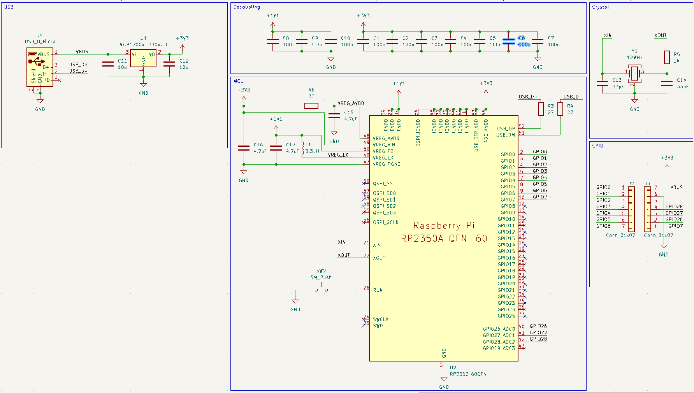
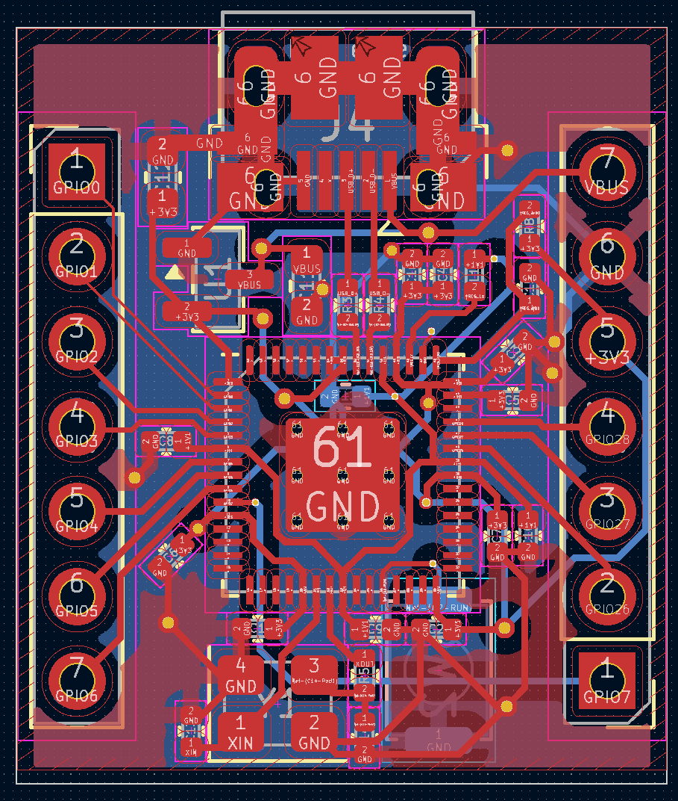
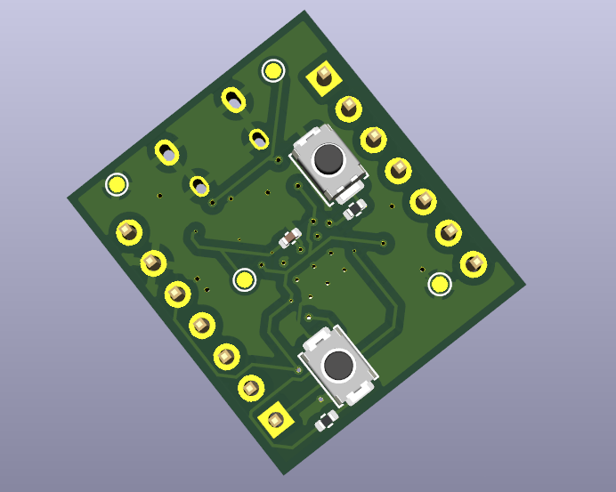
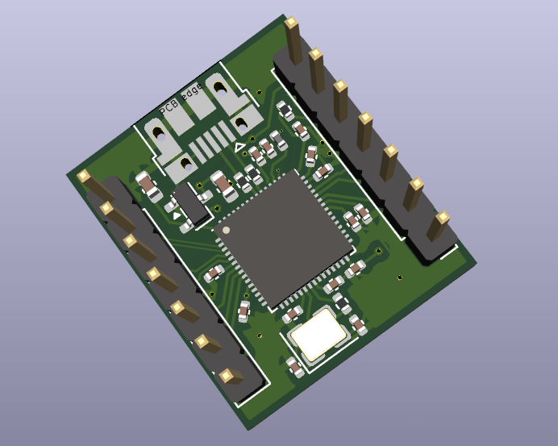
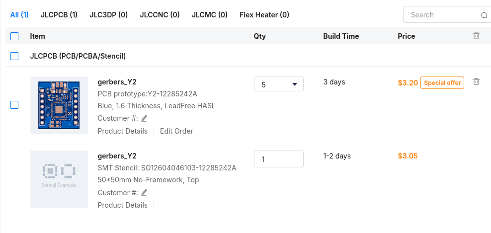

# RP2354-Micro-Devboard
A devboard based on the RP2354 in a small form factor. It is roughly the size of a Seeed Xiao RP2350, and it was going to be pin compatible, before I realised what a messy routing job that was going to be, so I switched the layout for something more logical.

This is probably just going to be used for some small boards that need an RP2350 but that I don't want to directly build the MCU into, without having to go acquire a Xiao, supermini, or something like that.

*many of the files are named as RP2350 because that is what I was using before

# Features
* Based on RP2354A with 2MB onboard flash (small flash is a compromise for small size)
* 2 layer PCB (this killed my sanity)
* 10 GPIO outputs
* USB Micro B power/data connection
* a really REALLY messy PCB routing job (it passed DRC tho so I guess thats something...)

Zine page (yes the render is outdated)\

Finished schematic (I'm using the 2350A footprint because they're pin compatible)\

Finished PCB\

PCB render\

JLCPCB order\

